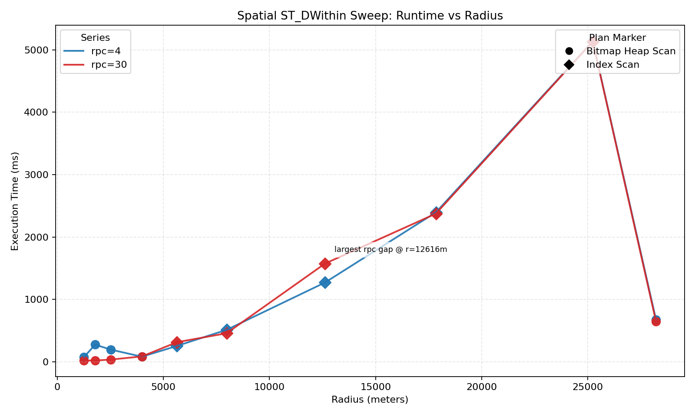
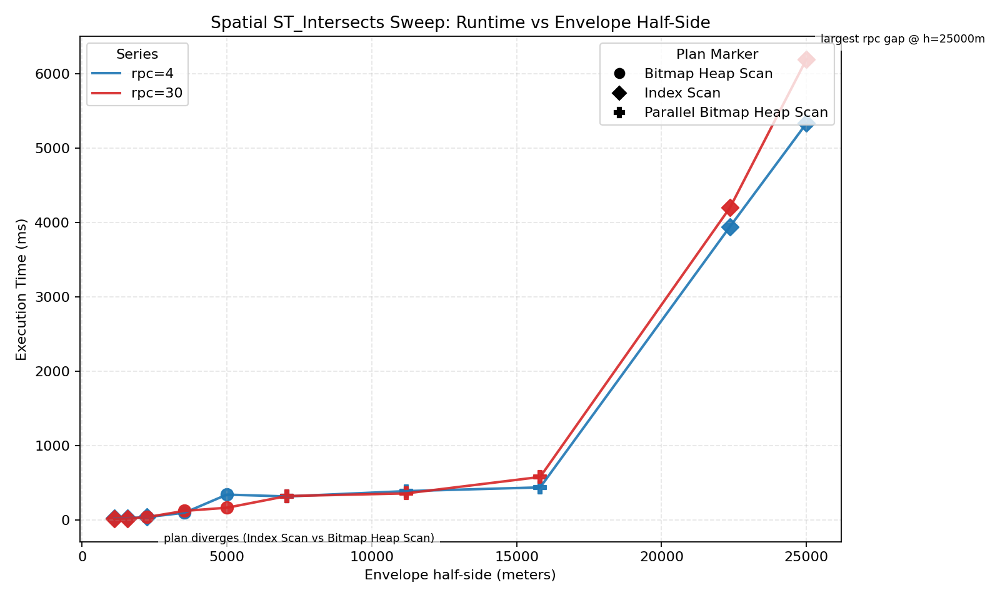
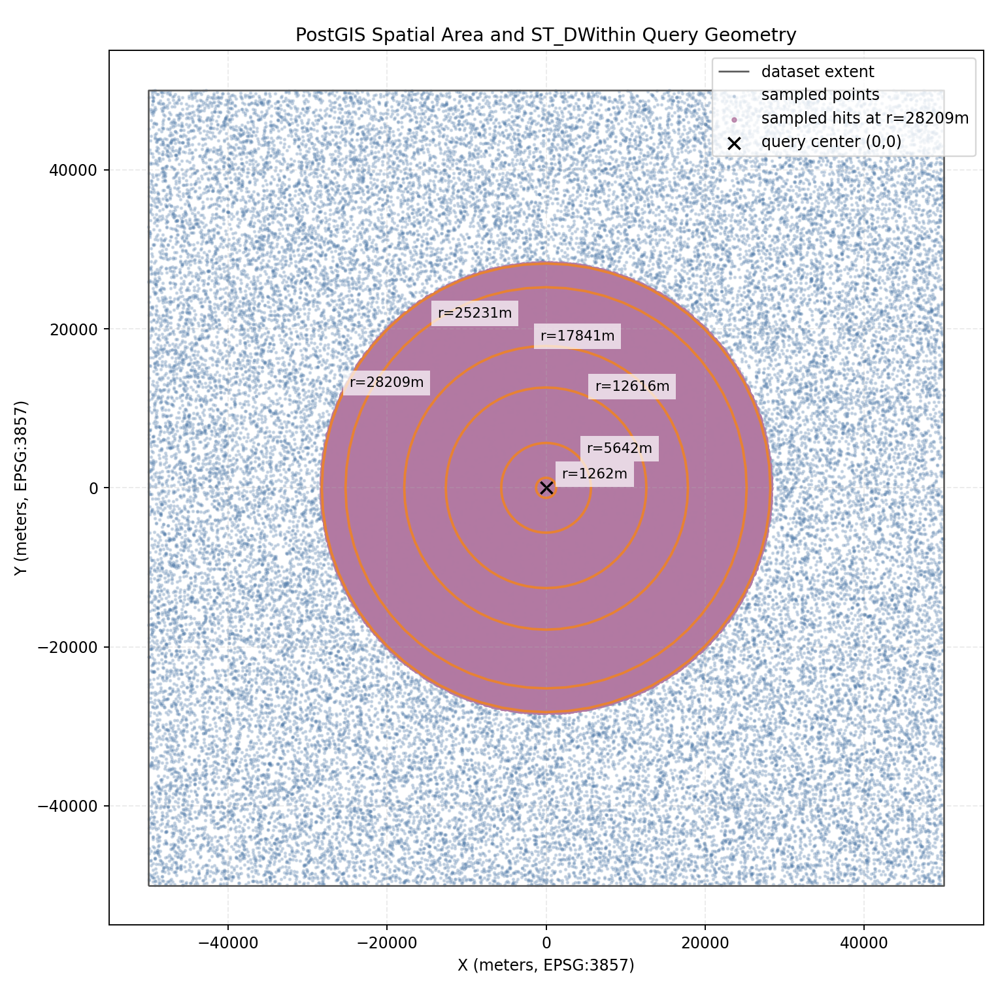

## The Real Cost of Spatial Random I/O (PostGIS Edition)

Repository: [decision-labs/2026-03-16-postgis-random-io](https://github.com/decision-labs/2026-03-16-postgis-random-io)

The Clerk plan-flip outage discussion is a strong reminder that sudden planner changes can take down hot paths. This repo studies one concrete failure mode behind that class of incident: miscalibrated `random_page_cost` values, often justified by the belief that SSD random I/O is "cheap enough" to treat similarly to sequential I/O.

For full narrative and context, see [`blogpost.md`](blogpost.md).

### What this repo contains

- PostgreSQL 17 + PostGIS experiment harness
- 1,000,000 random points (`EPSG:3857`) with GiST index
- Two spatial sweeps:
  - `ST_DWithin` radius sweep
  - `geom && envelope` + `ST_Intersects` sweep
- Default vs adjusted `random_page_cost` comparisons
- Visual outputs (charts + map)

### Machine specs used

- macOS 14.6.1 (Darwin 23.6.0, build 23G93)
- Apple M1 (8 CPU cores)
- 16 GB RAM
- `arm64`

### Key figures

`ST_DWithin` runtime comparison:

`ST_Intersects` runtime comparison:

Query area map:

### Why this is interesting

Even when both runs show the same plan family label (for example, bitmap variants), runtime can still diverge meaningfully. Plan family alone is not the full story: buffer hit/read mix, recheck/filter work, and cache/run-order effects can materially change observed latency.

### Repro

From this directory:

- `make init`
- `make build`
- `make sweep`
- `make compare RPC=30`
- `make graph`
- `make isweep`
- `make icompare RPC=30`
- `make igraph`
- `make map`

