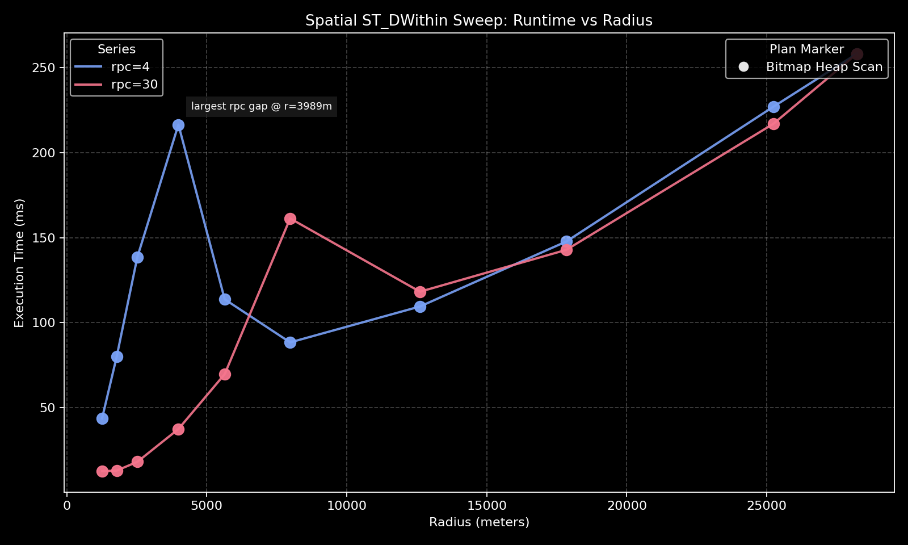
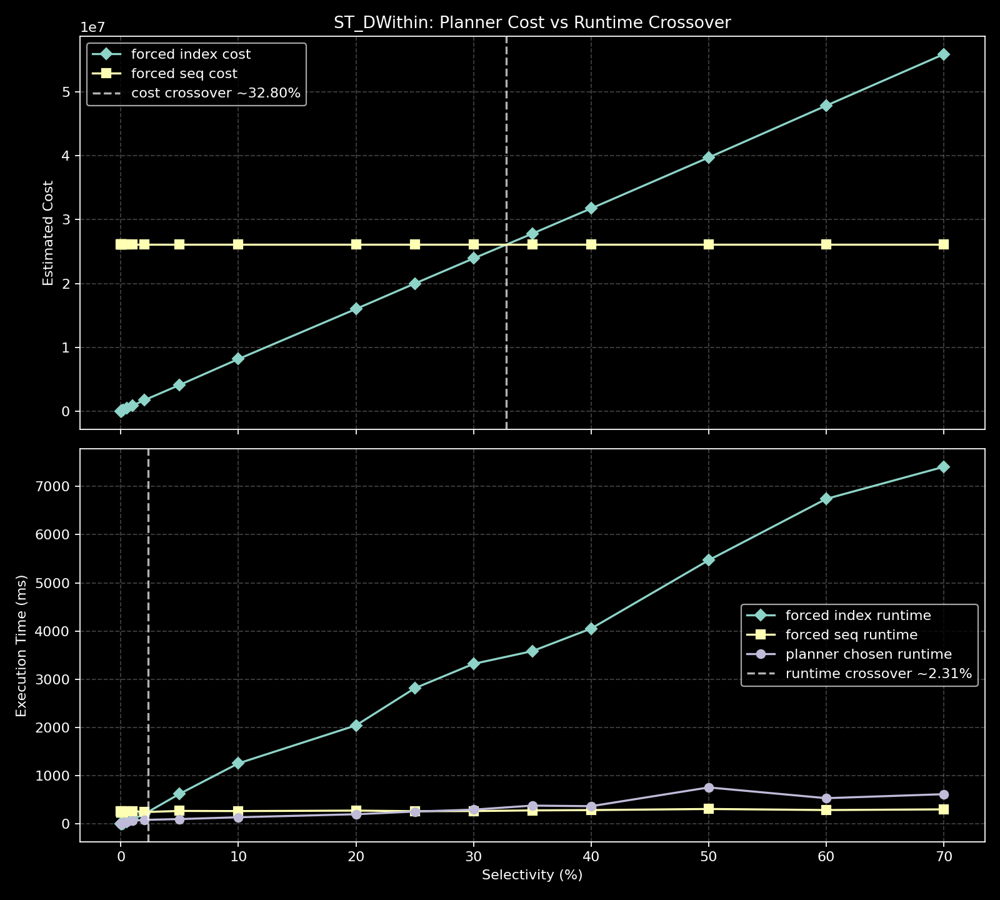
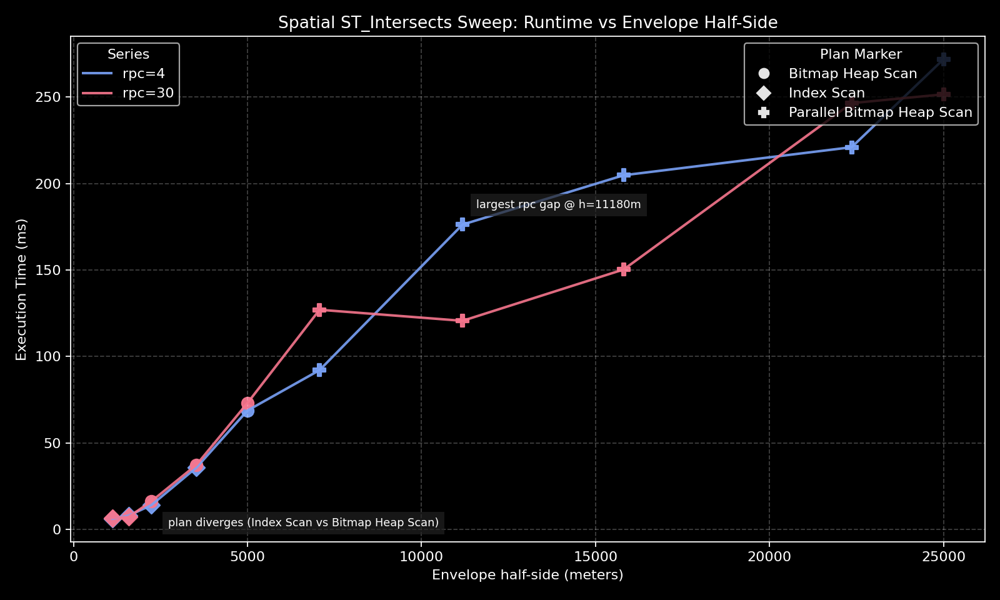
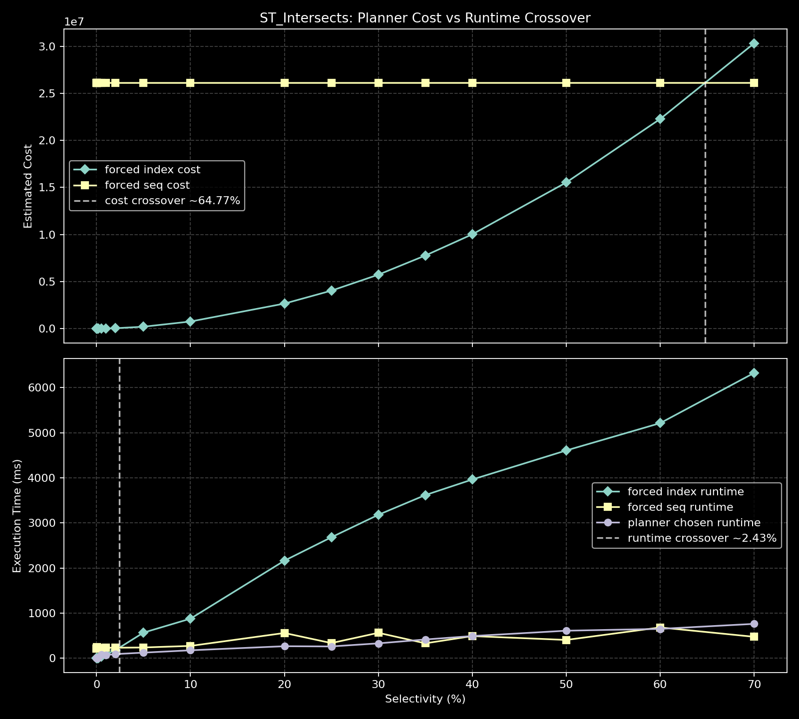
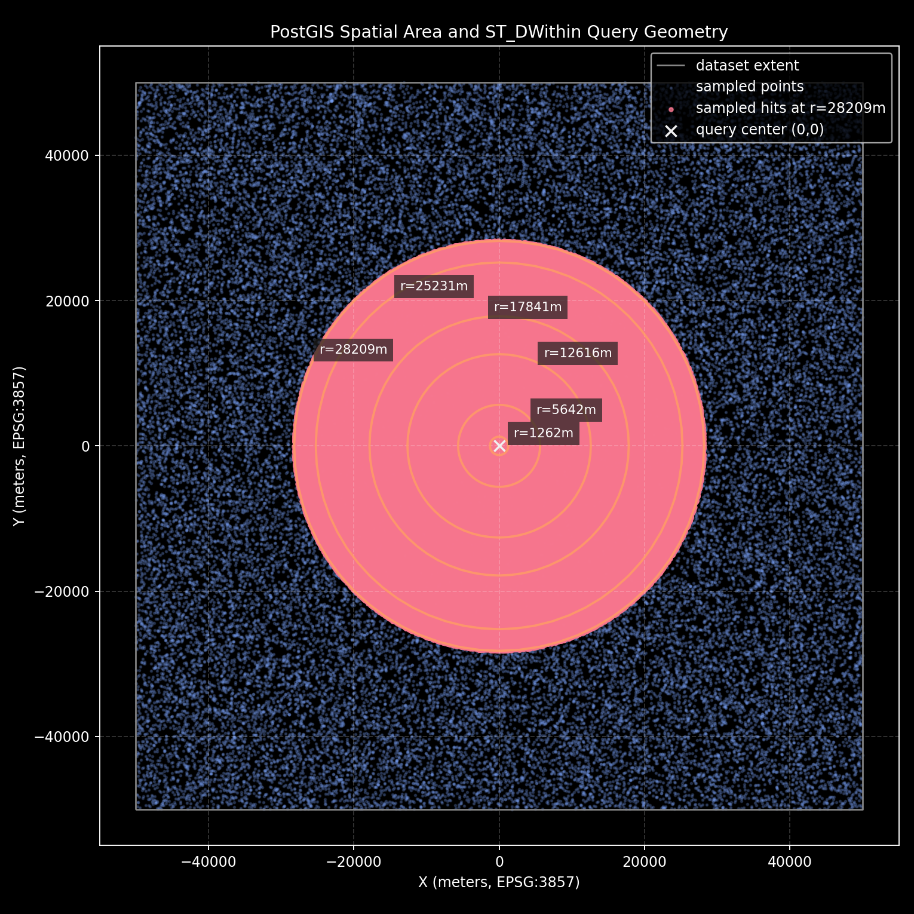
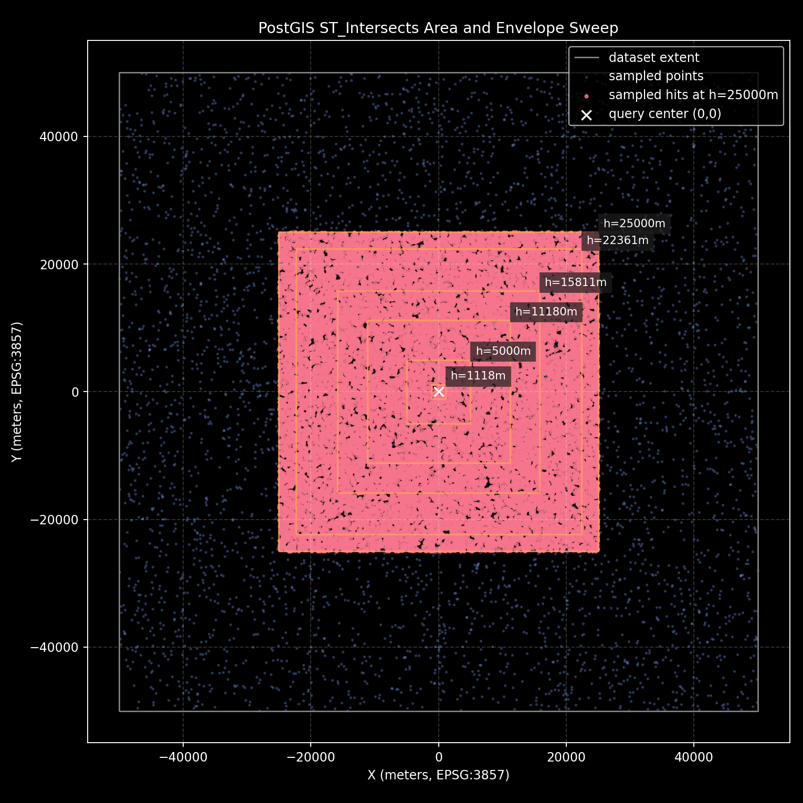

## The Real Cost of Spatial Random I/O (PostGIS Edition)

Short repo-first version: see [README](https://github.com/decision-labs/2026-03-16-postgis-random-io/blob/main/README.md).
Repository: [decision-labs/2026-03-16-postgis-random-io](https://github.com/decision-labs/2026-03-16-postgis-random-io)

The recent plan-flip outage discussion around Clerk is a good reminder that sudden planner changes can have real production impact when a hot-path query crosses into a worse plan unexpectedly.

One way plan choice can go wrong is when `random_page_cost` is set from the intuition that SSDs make random I/O almost as cheap as sequential I/O. That intuition is common, but in real workloads it can shift plan boundaries in ways that do not match observed runtimes.

This post looks at that specific failure mode in a spatial context: how a miscalibrated `random_page_cost` can move crossover points and create a selectivity band where the chosen plan is not the fastest path.

Reference: [The real cost of random I/O](https://vondra.me/posts/the-real-cost-of-random-io/#)
Context: [Postgres FM transcript: Plan flips](https://postgres.fm/episodes/plan-flips/transcript)

---

### What I tested

Environment:

- PostgreSQL 17 (local)
- PostGIS 3.6.1
- 5,000,000 random points in `EPSG:3857`
- GiST index on `geom`

Dataset extent is synthetic and centered around `(0,0)`, approximately `[-50000, 50000]` meters on each axis.

Machine specs:

- macOS 14.6.1 (Darwin 23.6.0, build 23G93)
- Apple M1 (8 CPU cores)
- 16 GB RAM
- `arm64` architecture

---

### Non-spatial crossover check

I included a forced-plan crossover probe to visualize:

- planner-estimated cost curves (forced index vs forced seq)
- actual runtime curves (forced index vs forced seq)
- planner-chosen runtime


How to read this graph:

- Top panel: planner-estimated cost for forced index vs forced seq plans.
- Bottom panel: measured runtime for forced index, forced seq, and planner-chosen path.
- Dashed vertical lines: estimated cost crossover and measured runtime crossover.

In this run:

- Estimated cost crossover was around `~1.55%`.
- Measured runtime crossover was around `~4.89%`.

Implication: tuning decisions based only on default planner costs can be misleading. If cost crossover and runtime crossover do not align, there is a selectivity band where the planner may pick a slower path. In practice, this means `random_page_cost` should be calibrated against measured runtimes on your own workload, not treated as a one-size-fits-all constant.

---

### Spatial experiment 1: `ST_DWithin`

I swept radius selectivity from very small up to about 25% area-equivalent selectivity, and compared:

- default `random_page_cost=4`
- adjusted `random_page_cost=30`



How to read this graph:

- X-axis: query radius in meters (selectivity proxy).
- Y-axis: execution time in milliseconds.
- Blue/red lines: `random_page_cost=4` vs `random_page_cost=30`.
- Marker shape: plan family at that point.

#### Observations

The key feature to notice first is the plan flip near the low-selectivity end: marker shape changes from bitmap-style access to index-style access, and runtime climbs sharply right after that transition. As radius grows further, the plan flips again toward parallel bitmap behavior and runtime drops. That "flip then drop" pattern is the main signal in this graph: plan family transitions are driving the big steps in latency, not a smooth linear slowdown.

#### `ST_DWithin` crossover (cost vs runtime)



How to read this graph:

- Top panel: forced-path planner cost (index vs seq).
- Bottom panel: forced-path runtime (index vs seq) and planner-chosen runtime.
- Dashed lines: estimated cost crossover vs measured runtime crossover.

In this run:

- Estimated cost crossover is around `~32.8%`.
- Measured runtime crossover is around `~2.31%`.

The key point is the gap between those two crossover locations. There is a broad band where the planner still prices index-like access as cheaper, but measured runtime already favors the sequential path.

---

### Spatial experiment 2: `geom && envelope` + `ST_Intersects`

I added a second sweep using square envelopes, which explicitly combines:

- bbox index filtering (`&&`)
- exact spatial predicate (`ST_Intersects`)



How to read this graph:

- X-axis: envelope half-side in meters (larger box = higher selectivity).
- Y-axis: execution time in milliseconds.
- Blue/red lines compare `random_page_cost=4` vs `random_page_cost=30`.
- Marker shape indicates the selected plan family.

#### Observations

This pattern is common in real GIS queries. It highlights that:

- candidate set growth can change quickly with envelope size
- exact predicate checks add CPU work beyond raw I/O
- planner constants can shift choices, but runtime shape still depends heavily on data locality and cache state

#### `ST_Intersects` crossover (cost vs runtime)



How to read this graph:

- Top panel: forced-path planner cost (index vs seq).
- Bottom panel: forced-path runtime (index vs seq) and planner-chosen runtime.
- Dashed lines: estimated cost crossover vs measured runtime crossover.

In this run:

- Estimated cost crossover is around `~64.77%`.
- Measured runtime crossover is around `~2.43%`.

This is an even wider mismatch than `ST_DWithin` in this dataset: runtime prefers seq much earlier than the planner cost model suggests.

---

### Query area map

The first map shows the synthetic extent, sampled points, query center, and radii used for `ST_DWithin`.



The second map shows the same extent with envelope half-sides used for `ST_Intersects`.



How to read this map:

- Square boundary: synthetic dataset extent.
- Point cloud: sampled points from the table.
- `X` marker: query center at `(0,0)`.
- Concentric outlines or nested envelopes: tested query sizes used in sweeps.
- Highlighted points: sampled hits at the largest query size.

### Why `ST_DWithin` and `ST_Intersects` curves differ

Both query families use `&&` prefiltering, but they do not pay the same recheck cost.

For `ST_DWithin`, PostGIS uses `geom && ST_Expand(point, r)` first (a square), then exact `ST_DWithin(...)` on the surviving candidates (a circle). For uniformly distributed points, that square-vs-circle mismatch introduces a near-constant false-positive tax:

- circle / square area ratio = `pi/4` (~78.5%)
- expected false-positive share = `1 - pi/4` (~21.5%)

That is exactly what we observe at high selectivity in this run: the plan keeps a large bitmap path but still reports substantial `Rows Removed by Filter`, consistent with the geometric mismatch.

For `ST_Intersects` with an envelope, we also use `&&`, but the exact predicate is rectangle-based and aligns much more closely with the prefilter shape, so the middle-of-curve offset behavior is smaller and more stable.

This matches PostGIS docs that `ST_DWithin` includes a bounding-box comparison and uses spatial indexes: [ST_DWithin](https://postgis.net/docs/manual-dev/ST_DWithin.html), [ST_Expand](https://postgis.net/docs/ST_Expand.html).

```22:32:/Users/shoaib/code/scaling-postgresql-katas/2026-03-16-postgis-random-io/results/03_gist_scan.out
Aggregate  (cost=1012.73..1012.74 rows=1 width=8) (actual rows=1 loops=1)
  Buffers: shared hit=94 read=13
  ->  Bitmap Heap Scan on points_1m  (cost=4.90..1012.48 rows=100 width=0) (actual rows=72 loops=1)
        Filter: st_dwithin(geom, '0101000020110F000000000000000000000000000000000000'::geometry, '400'::double precision)
        Rows Removed by Filter: 19
        Heap Blocks: exact=91
        Buffers: shared hit=94 read=13
        ->  Bitmap Index Scan on points_1m_geom_gix  (cost=0.00..4.88 rows=62 width=0) (actual rows=91 loops=1)
              Index Cond: (geom && st_expand('0101000020110F000000000000000000000000000000000000'::geometry, '400'::double precision))
              Buffers: shared hit=3 read=13
```

---

### Practical takeaways

1. Treat `random_page_cost` as a workload calibration knob, not a fixed truth.
2. For PostGIS, evaluate both:
   - path family changes (index/bitmap/seq/parallel variants)
   - runtime changes within the same family.
3. Always pair `EXPLAIN (ANALYZE, BUFFERS)` with careful runtime measurement.
4. If you want to claim crossover behavior, plot both cost and runtime curves explicitly.
5. In this run, both spatial query families show runtime crossover near `~2.4%`, while cost crossover is much later (`~32.8%` and `~64.8%`).

---

### Repro commands

From `2026-03-16-postgis-random-io/`:

- `make init`
- `make build ROWS=5000000`
- `make sweep`
- `make compare RPC=30`
- `make graph`
- `make isweep`
- `make icompare RPC=30`
- `make igraph`
- `make map`
- `make dcrossover`
- `make dgraph-crossover-dark`
- `make icrossover`
- `make igraph-crossover-dark`
- `make imap-dark`

From `2026-03-16-random-io-cost/`:

- `make crossover`
- `make graph-crossover`
